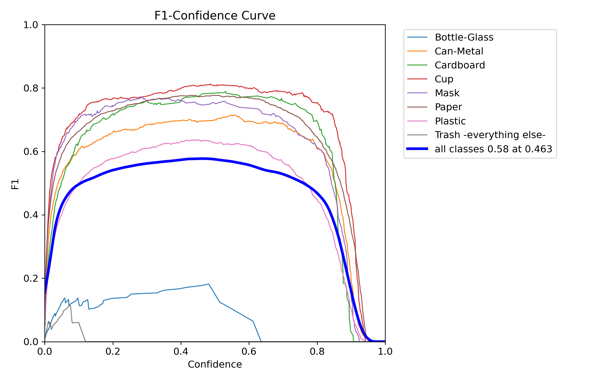
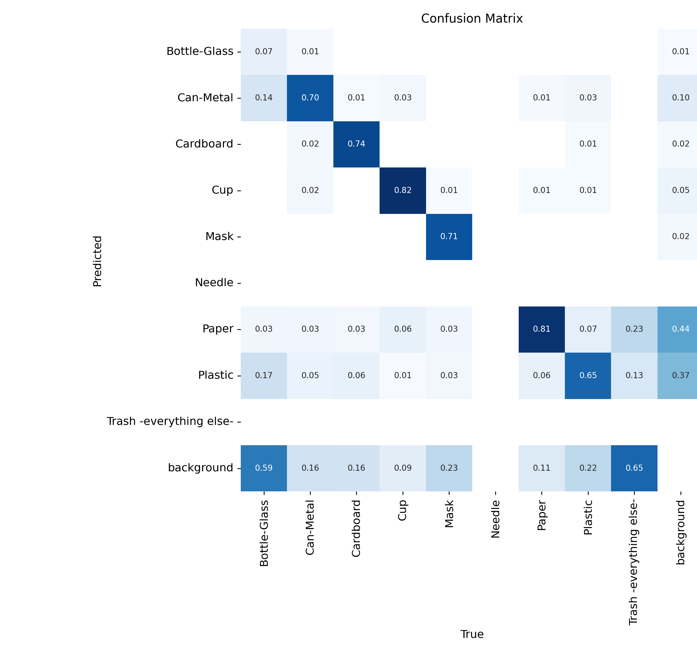
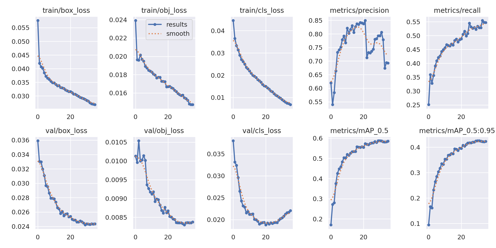

# Trash_Detection
Trash Detection Model (YOLOv5 PyTorch)

This repository contains a custom-trained YOLOv5 object detection model built with PyTorch to detect trash and litter in images. The goal of this project is to support automated waste detection for applications such as:

Autonomous trash-collecting drones
Smart city monitoring
Environmental cleanup initiatives
Educational and research tools
The model has been trained on a large dataset of labeled images containing various types of trash (plastic, cans, paper, bottles, etc.) in diverse environments such as streets, parks, beaches, and natural landscapes.

Features

Real-time object detection performance
Supports batch image processing
Lightweight and deployable to edge devices (Raspberry Pi, NVIDIA Jetson, etc.)
Compatible with video streams for live detection
Trained using YOLOv5 architecture and PyTorch framework
Model Artifacts

best.pt — The trained YOLOv5 model weights

Images:

Confidence Curve:

Confusion Matrix:

Images: 

Results:

Note:

I chose to do 36 epochs, as I found after that performance began to fall off:

