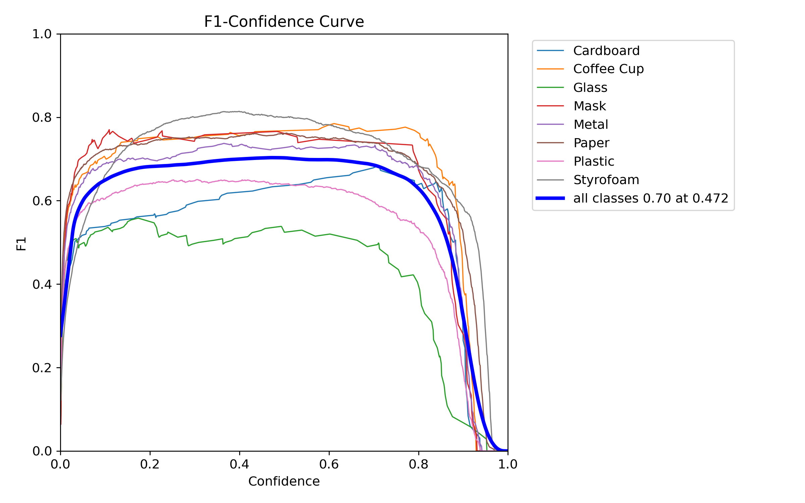
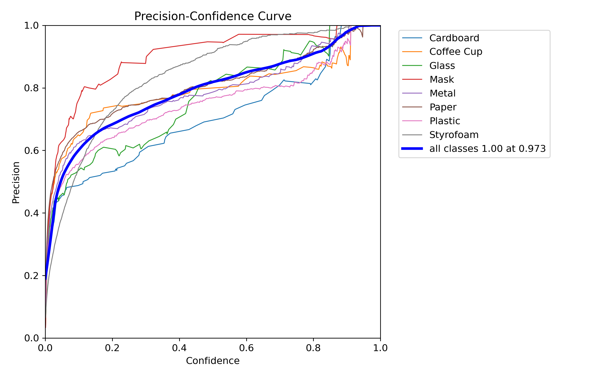
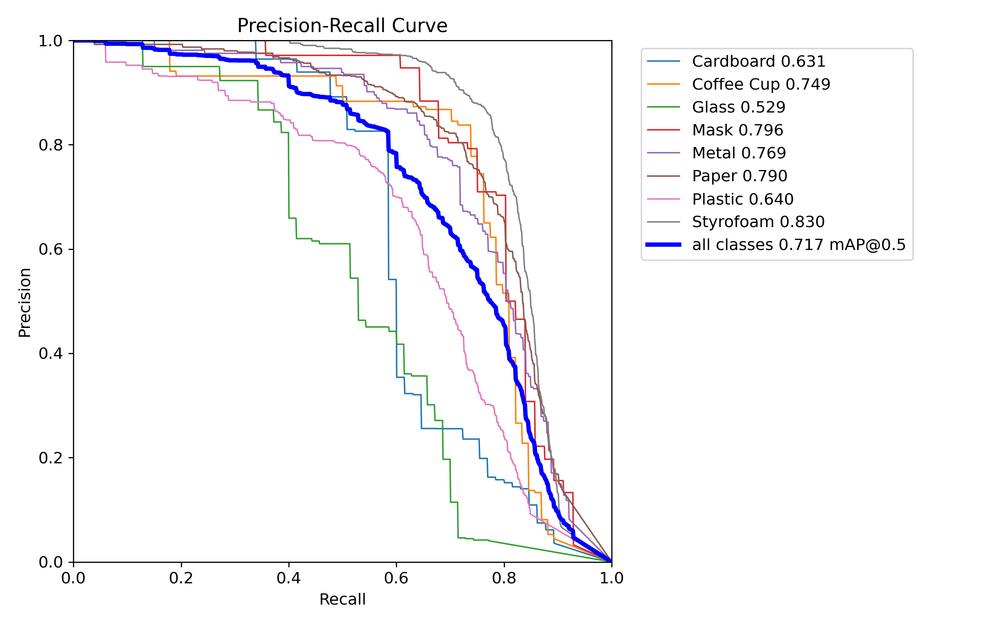
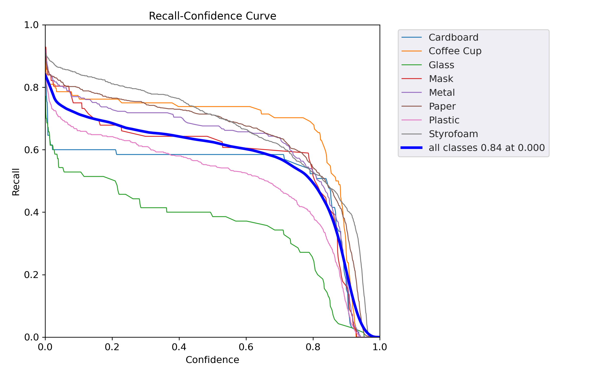
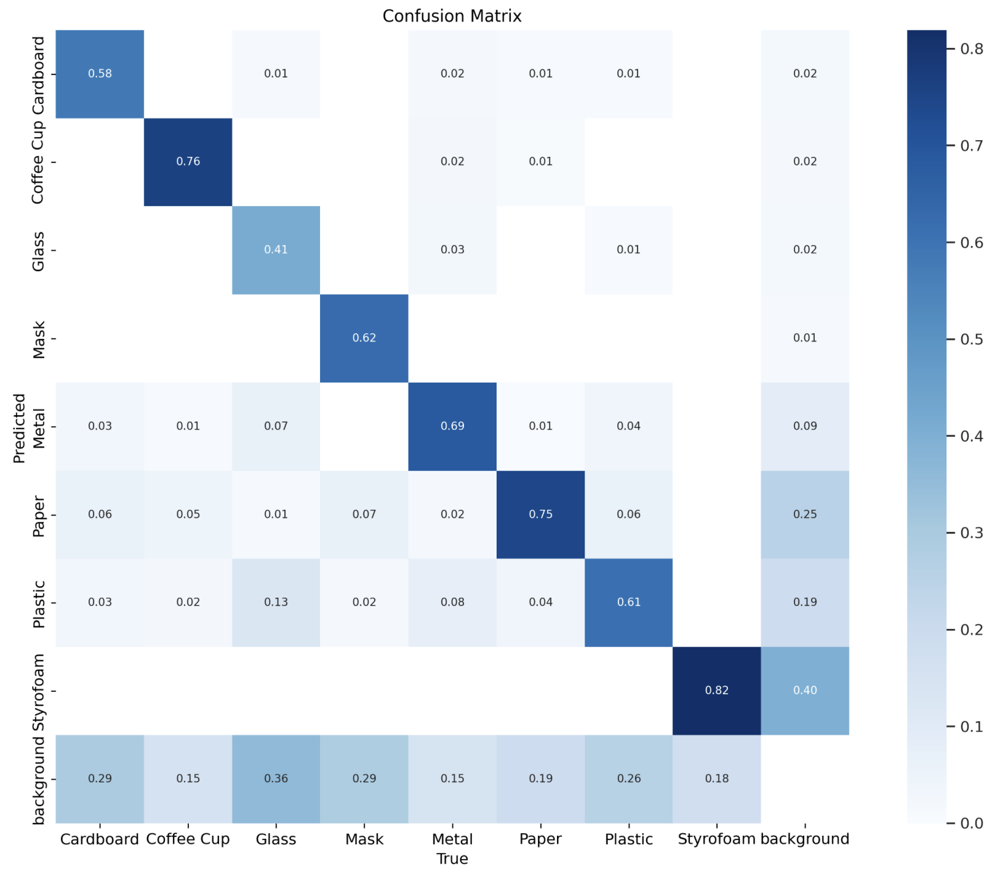
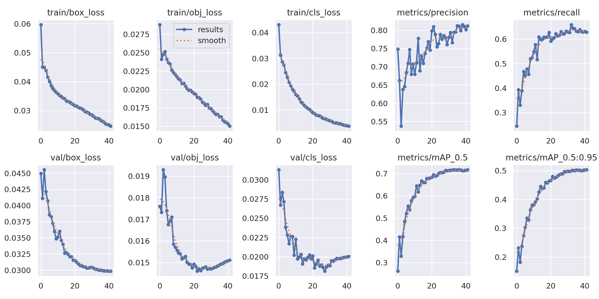
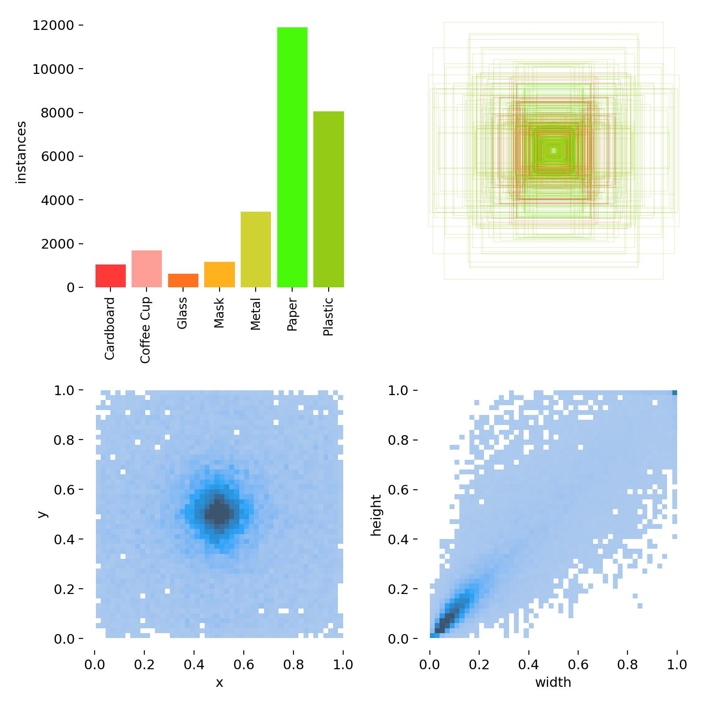
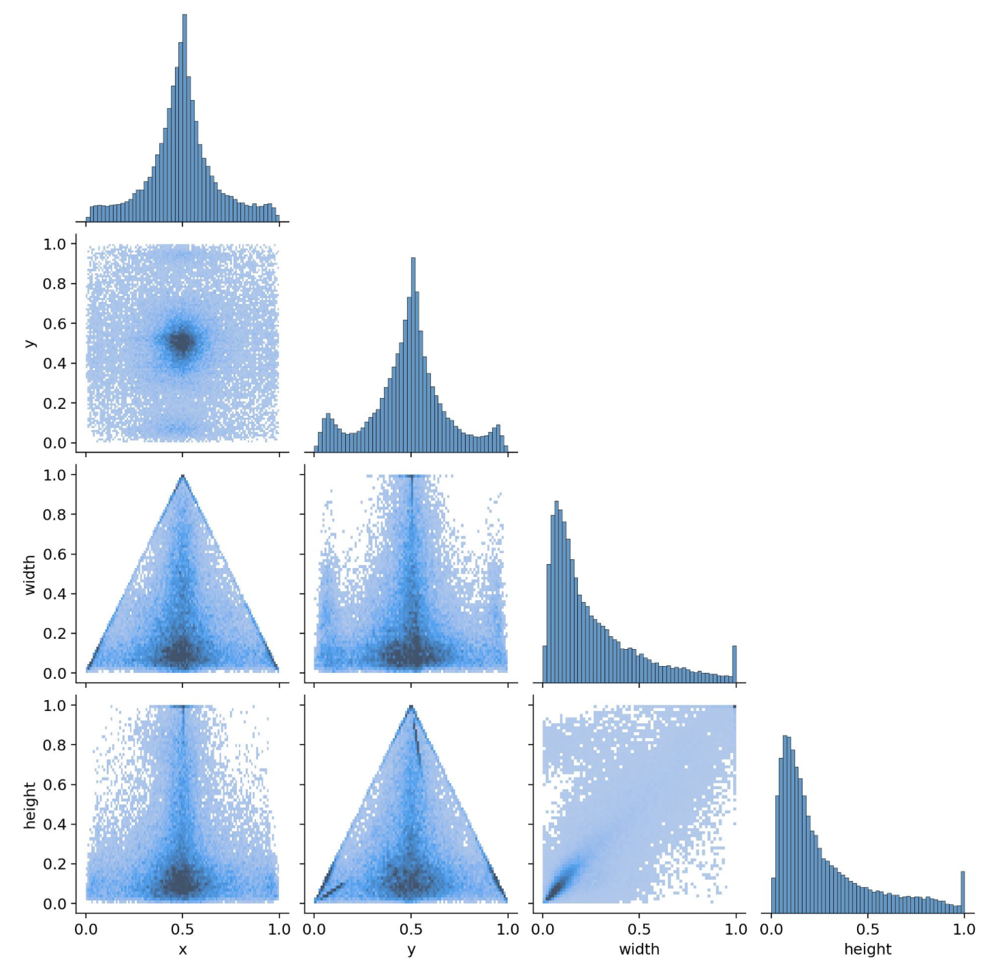

# Trash_Detection

Trash Detection Model (YOLOv5 PyTorch)

This repository contains a custom-trained YOLOv5 object detection model built with PyTorch to detect trash and litter in images. The model has been trained on a large dataset of labeled images containing various types of trash (plastic, cans, paper, bottles, etc.) in diverse environments such as streets, parks, beaches, and natural landscapes. The goal of this project is to support automated waste detection for applications such as:

- Autonomous trash-collecting drones

- Smart city monitoring

- Environmental cleanup initiatives

- Educational and research tools

### Features:

- Real-time object detection performance

- Can differentiate between different types of trash

- Supports batch image processing

- Lightweight and deployable to edge devices (Raspberry Pi, NVIDIA Jetson, etc.)

- Compatible with video streams for live detection

- Trained using YOLOv5 architecture and PyTorch framework

## Dataset

https://drive.google.com/drive/folders/1RZOjxU6KcMJte-Xc5aZ8q1uYAKh5kP35?usp=share_link 

NOTE: Preprocessing and augmentations are already applied:

Preprocessing: 
- Auto-Orient: Applied
- Resize: Fit (reflect edges) in 640x640
- Auto-Adjust Contrast: Using Contrast Stretching
  
Augmentations (3 outputs per training example):
- Flip: Horizontal, Vertical
- Rotation: Between -15° and +15°
- Shear: ±5° Horizontal, ±5° Vertical
- Hue: Between -15° and +15°
- Saturation: Between -15% and +15%
- Brightness: Between -15% and +15%
- Exposure: Between -15% and +15%
- Blur: Up to 0.2px
- Noise: Up to 0.5% of pixels

## Repository:

Best_Weights.pt — The trained YOLOv5 model weights

Requirements.txt - Necessary Python Dependencies

Hyp.yaml - The hyperparameters I used when training

Results.csv - Logged performance metrics for each epoch

Trash_Detection_Script.py - The script I used for training

### Images:

## Confidence Curves:

### Confusion Matrix:

### Performance Graphs: 

## Label Graphs

## Notes:

- I recommend a confidence of 0.4 for inference, it has worked best for me
- If you choose to train a similar model, I do not recommend using the cosine learning rate, as my recall dropped off enormously after epoch 40
- It is helpful to cache (use --cache in the training command), as I found the training was faster that way
- When training this model, mAP tended to stop increasing after epoch 40, or if it did it was too minimal to have any real effect on the performance

