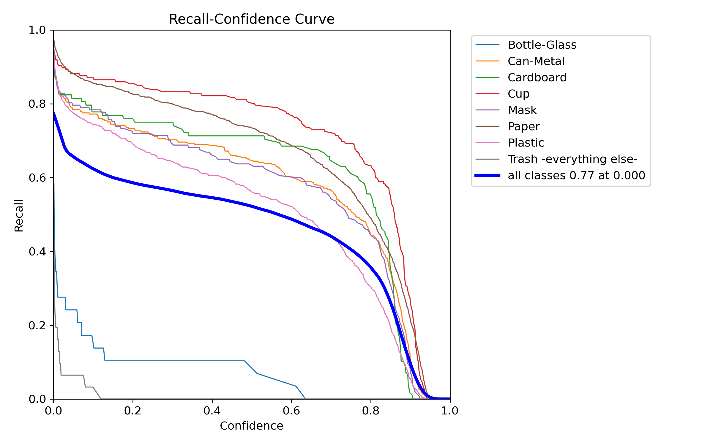
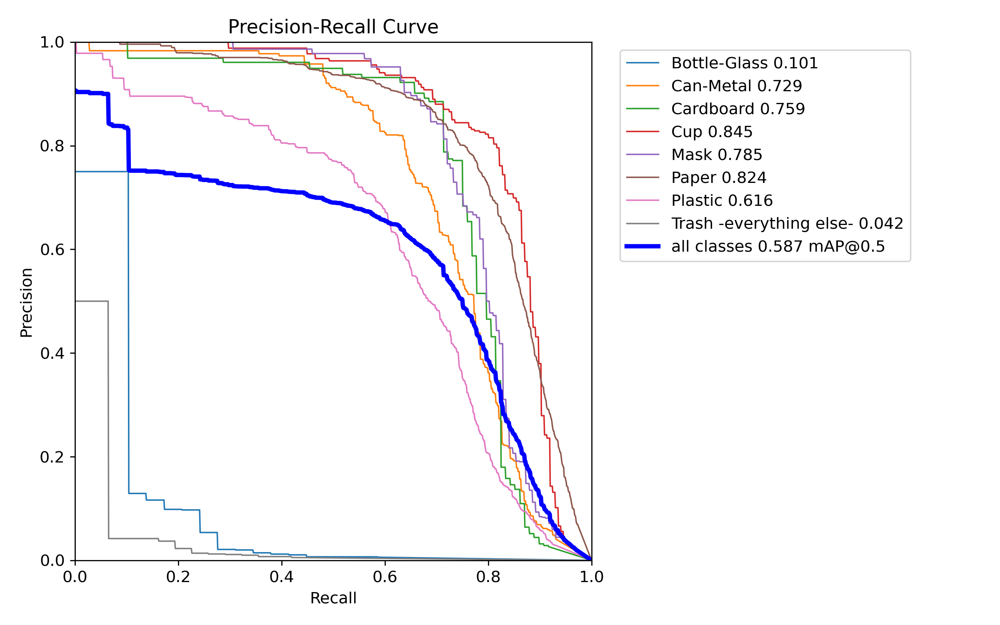
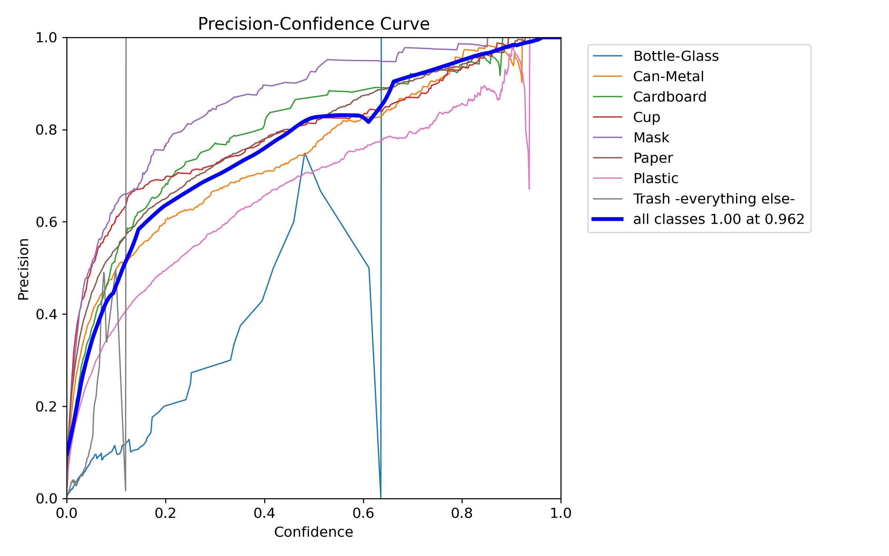
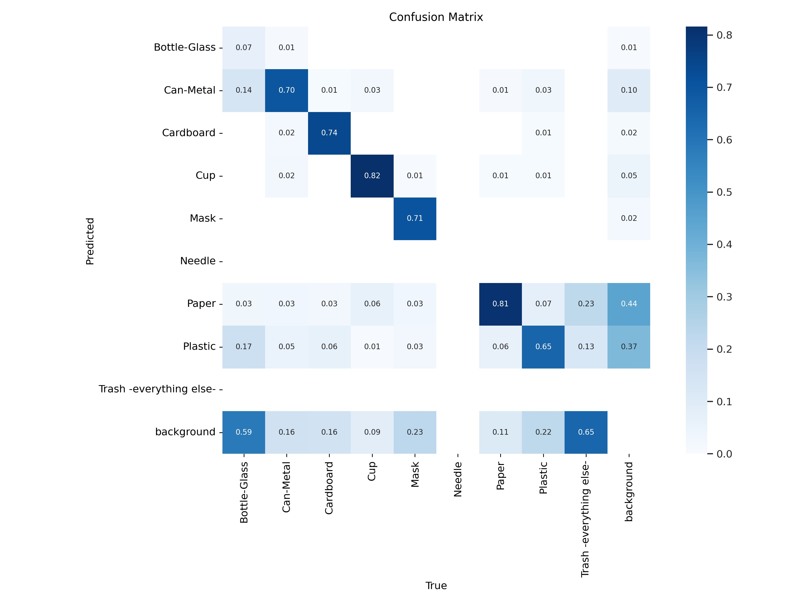
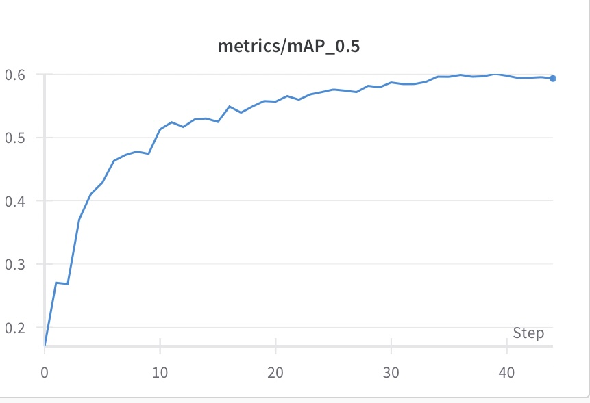
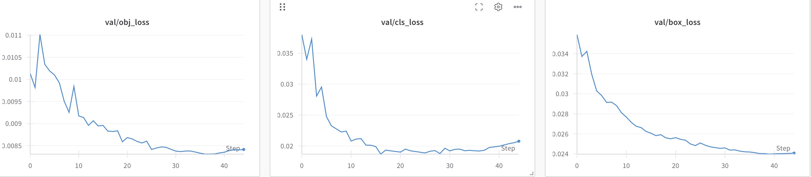
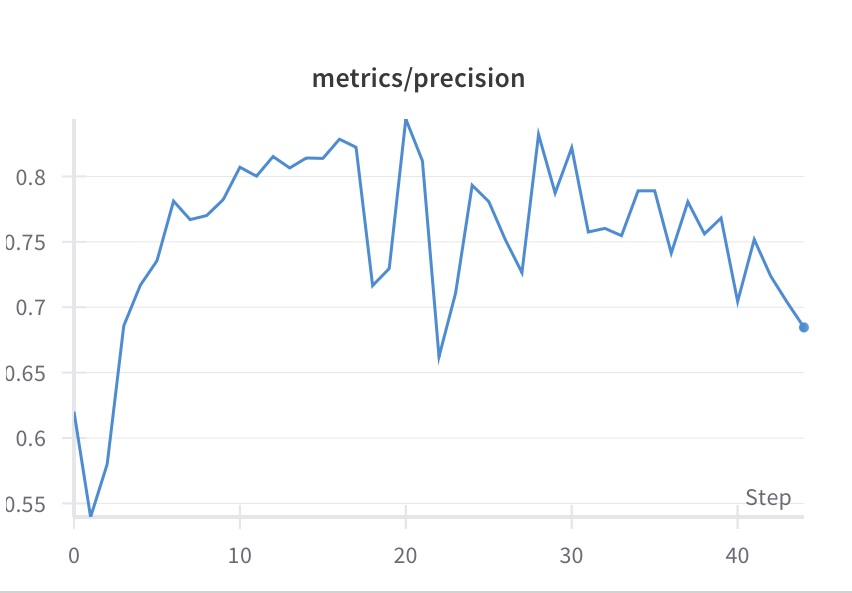

# Trash_Detection
Trash Detection Model (YOLOv5 PyTorch)

This repository contains a custom-trained YOLOv5 object detection model built with PyTorch to detect trash and litter in images. The model has been trained on a large dataset of labeled images containing various types of trash (plastic, cans, paper, bottles, etc.) in diverse environments such as streets, parks, beaches, and natural landscapes. The goal of this project is to support automated waste detection for applications such as:

- Autonomous trash-collecting drones

- Smart city monitoring

- Environmental cleanup initiatives

- Educational and research tools

### Features:

- Real-time object detection performance

- Can differentiate between different types of trash

- Supports batch image processing

- Lightweight and deployable to edge devices (Raspberry Pi, NVIDIA Jetson, etc.)

- Compatible with video streams for live detection

- Trained using YOLOv5 architecture and PyTorch framework

## Repository:

Best_Weights.pt — The trained YOLOv5 model weights

### Images:

Confidence Curves:

### Confusion Matrix:

### Graphs: 

### Results:

### Note:

I chose to do 36 epochs, as I found after that performance began to fall off after:

